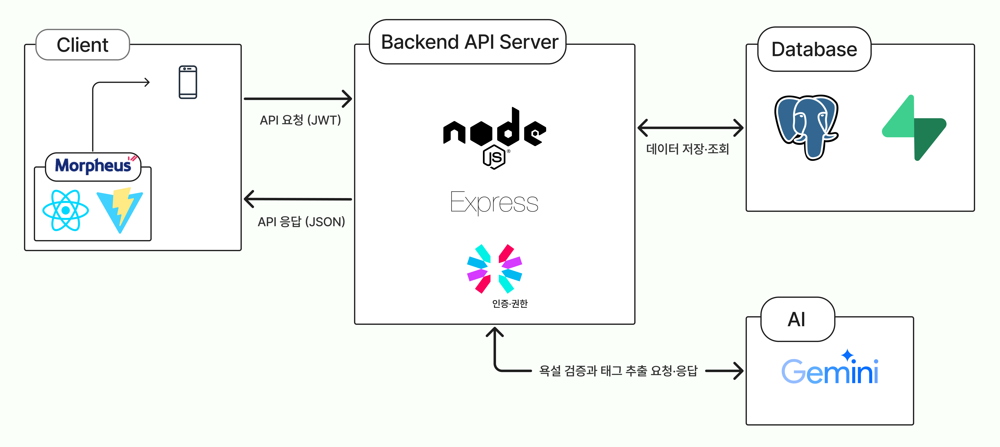

# Study Mate - 중·고등학생 학습 챌린지 소셜 플랫폼

## 1. 프로젝트 소개

혼자 공부하기 어려운 중·고등학생들이 친구들과 함께 공부 습관을 만들 수 있도록 도움을 주는 학습 습관 챌린지형 SNS 플랫폼입니다.

---

## 2. 시연 영상 & Screenshots

- 시연 영상: [YouTube 링크](https://www.youtube.com/watch?v=56meGnLQRFo)


---

## 3. 프로젝트 개요

1. 자기주도 학습 지속 한계

   - 많은 학생이 목표는 알차게 세우지만 꾸준히 실천하는 데 어려움을 겪습니다.
   - 서울대 교육학과 신종호 교수는 자기주도 학습이 흔히 실패하는 이유로 "공부를 하는 이유에 대한 목적의식의 부재", "흥미 결여", "혼자 공부하기의 난이도"를 지적합니다.
   - 따라서 학생들에게는 학습을 지속하게 만들 공부 이유와 필요성이 필요합니다.

2. 기존 학습 도구의 한계

   - 타이머 중심 기능
     - 기존의 학습앱(열품타, Flipd)은 공부 시간 측정과 집계에만 집중되어 실제 학습 진도와 성취도를 보장하지 못합니다.
     - 이는 시간만 채우는 보여주기식 경쟁으로 이어질 수 있습니다.
   - 과제 단위 관리 부재
     - 학생의 공부는 '단어 암기', '문제집 풀이' 같은 구체적인 단위로 이루어집니다.
     - 그러나 기존 앱은 과목별·단계별 목표 설정 기능이 부족하며 수행한 과제를 단순 총 공부 시간으로 합산하여 기록하는 방식입니다.
   - 동기부여 부족 및 상호작용 부족
     - 단순 시간 기록과 랭킹외에는 구체적인 학습 내용에 대한 피드백이나 인증 수단이 부족합니다.
     - 서로의 학습 내용을 확인하고 서로 응원하는 상호작용 없어 함께 공부한다는 느낌을 주기 어렵습니다.

3. 해결 방안

   - 그래서 저희는 단순 시간을 측정하는 것이 아닌 구체적인 목표를 챌린지로 설정하고 그 결과를 인증하고 공유하는 행동 중심 플랫폼 Study Mate를 기획했습니다.
     - 공부 시간 경쟁이 아닌 오늘 수행한 학습 목표를 인증함으로 실질적인 성취감을 부여하고,
     - 친구들과 서로 인증글을 확인하고 응원하며 함께 성장하는 환경을 만들고,
     - 달성률 그래프와 인증 기록으로 자신의 누적 성과를 시각적으로 확인하고 지속적인 동기를 얻도록 설계했습니다.

4. 주요 타겟

   - 주요 타겟은 혼자서 장기적으로 공부하기 어려운 중·고등학생입니다.

---

## 4. 주요 기능

### 4.1 챌린지 생성 및 참여

- 제목, 시작일, 주간 빈도를 입력해 학습 챌린지 생성
- 챌린지 참여 기능을 통해 해당 챌린지에 참여 가능
- 참여자 목록, 자신의 참여 여부 표시
- 좋아요 수·참여자 수·인증글 수 실시간 표시

### 4.2 학습 인증

- 하루 1회 인증글 업로드(목표·요약·자료·학습 시간 등 JSON 기반)
- 응원자 목록, 자신의 응원 여부 표시
- 각 인증글의 응원 수 실시간 표시

### 4.3 소셜 기능

- 사용자 사이의 팔로우 기능
- 챌린지별 좋아요 토글
- 인증글별 응원 토글
- 달성률 기반 실시간 랭킹 기능

### 4.4 달성률 시각화

- 참여·등록 챌린지별 주간 달성률 막대 그래프
- 전체·최근 30일 달성률 그래프
- GitHub 잔디형 캘린더

### 4.5 AI 기능

- 인증글 기반 개인화 챌린지 추천 (Gemini API)
  - 인증글에서 태그를 추출하고, 해당 태그를 바탕으로 추천 챌린지 정렬
- 욕설·비방 검증 (Gemini API)
  - 인증글 업로드 시 SNS 안전 확보를 위해 Gemini API로 욕설·비방 등 유해 표현을 사전 차단

---

## 5. Stack

- **Frontend**: React, Vite, Morpheus(유라클)
- **Sever**: Node.js (Express), JWT
- **DB**: PostgreSQL (Supabase)
- **Dev Tool**: VS Code, Android Studio, Postman, GitHub

---

## 6. 설치 & 실행 방법

### 1) 환경 변수

- Supabase DB URL 필요
- Gemini API 필요

### 2) DB Migration

- 참고: [DB Migration](./server/src/db/migrations/)

### 3) 클라이언트

```bash
cd study-mate
npm install

npm run dev --host
```

### 4) 서버

- terminal을 2개 사용합니다.

```bash
cd server
npm install

npm run dev
```

```bash
cd server

npm run worker
```

---

## 7. 시스템 구조



---

## 8. 역할 분담

- 박정현 : UI/UX 설계, Server 설계 및 구현, DB 설계 및 구현, PPT 제작
- 김지훈 : UI/UX 설계, Frontend 구현, UI/UX 구현
- 한진환 : UI/UX 설계, Frontend 구현

---

## 9. 향후 개선 계획

- 푸시 알림·학습 타이머 연동
  - 미인증 참여자 대상 ‘재촉하기’ 알림을 도입하여 챌린지 동기 유지
  - 학습 타이머·인증 연동으로 기록 정확도 향상
- AI 인증 검증 도입
  - AI 욕설·비방 검증을 넘어 챌린지 적합성·허위 내용까지 자동 검증하는 피드백 절차 마련
- 학교별 챌린지 개설하여 지역별·학교별 랭킹으로 확장
  - 학교 단위 챌린지 개설 및 지역별·학교별 랭킹 시스템으로 확장하여 경쟁과 참여 유도
- 사용자 인증글에 기반한 학습 리포트 생성
  - 누적 인증 데이터를 기반으로 학습 리포트를 생성하여 사용자에게 객관적인 학습 기록을 제공하고, 사용자가 학습 방향 설계에 참고
