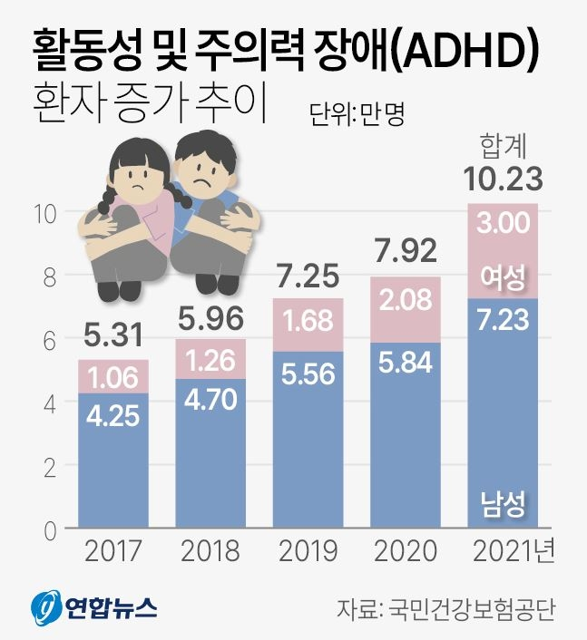

# PPT

- 표지, 목차 포함 최대 16 슬라이드

## 1 슬라이드

(로고)경일대학교x유라클

경북 네트워크형 캠퍼스 SW아카데미 풀스택 개발자 양성과정 7기

프로젝트 주제명 : 중·고등학생 학습 챌린지 소셜 플랫폼

- 학교명: 경일대학교
- 팀명: Study Mate
- 팀장: 박정현
- 팀우너: 김지훈, 한진환

## 2 슬라이드 : 목차

### 1. 프로젝트 개요

1. 프로젝트 추진 배경
2. 활용 목적 및 타겟 오디언스
3. 프로젝트 개발 환경

### 2. 추진체계 및 일정

1. 팀 조직도 및 역할분담
2. 개발 일정
   - 요구 분석, 설계, 개발, 통합 테스트 등 프로젝트 진행 일정 기술

### 3. 시스템 개발 내용

1. 전체 시스템 구성도(사이트 맵)
2. 사용자 인터페이스(UI)
3. 서비스 별 설명(ex: (1) 메인페이지, (2) 회원 서비스, (3) 기타 등등 자율)

### 4. 시연 영상 및 기대효과

1. 시연 영상
   - 3분 내외
2. 프로젝트 기대효과
3. 향후 계획 및 보완사항

## 3 슬라이드 : 프로젝트 개요-추진배경

- 작성 사항
  - 본 프로젝트를 수행하게 된 추진 배경, 어떠한 문제를 해결하기 위한 배경 등에 대해 설명

---

[예상 슬라이드 내용]

- 자기주도 학습이 흔히 실패하는 이유는 공부 목적의식의 부재, 흥미 결여, 혼자 공부하기의 난이도
- ADHD 진단 학생 수가 2017년 5만 3천명에서 2021년 10만명으로 두 배 가까이 증가(ADHD_statistics 자료: 국민건강보험공단 자료)
- 청소년 스마트폰 과의존 위험군 비율이 42.6%로 나타나 디지털 환경이 오히려 주의 분산을 키움(smart_phone_statistics 자료: 과학기술정보통신부 통계)
- SNS는 학습 목표/진도/동기 설계 기능이 부족, 습관앱은 동료 기반 상호작용이 약함

---

[대사]

많은 학생이 목표는 알차게 세우지만 혼자 꾸준히 실천하는 데 어려움을 겪습니다.
신종호 서울대 교육학과 교수는 자기주도 학습이 흔히 실패하는 이유로 "공부 목적의식의 부재, 흥미 결여, 혼자 공부하기의 난이도"를 지적합니다.

한편, 최근 5년 사이 학생의 주의/집중 관련 지원 필요도도 커지고 있습니다. 국민건강보험공단 자료에 따르면 ADHD 진단 학생 수가 국민건강보험공단 자료에 따르면 ADHD 진단 학생 수가 2017년 5만 3천명에서 2021년 10만명으로 두 배 가까이 늘었습니다. 여기에 더해 과학기술정보통신부 통계에서는 청소년 스마트폰 과의존 위험군 비율이 42.6%로 나타나 디지털 환경이 오히려 주의 분산을 키우고 있습니다.

그런데 지금 학생들이 가장 많이 사용하는 도구인 SNS는 학습 목표/진도/동기 설계 기능이 부족하고, 습관앱은 동료 기반 상호작용이 약해 꾸준함을 만들기 어렵습니다. 결국 핵심은 혼자 공부하는 구조에 있다고 보았습니다.

## 4 슬라이드 : 프로젝트 개요-활용 목적 및 타겟 오디언스

- 작성 사항
  - 본 프로젝트의 활용 목적과 어떤 대상층이 타겟 오디언스가 되는지 기술
  - 이를 통해 대상층에게 어떤 효과를 제공할 수 있는지 간략히 설명

---

[예상 슬라이드 내용]

- 혼자 하는 공부 => 친구와 함께
- 챌린지를 만들고 매일 한 번의 인증과 친구들과 서로 응원/경쟁 => 꾸준한 실천

---

[대사]

그래서 저희는 중·고등학생들을 대상으로 혼자 하는 공부를 친구와 함께하는 챌린지로 바꾸는 학습 습관 소셜 플랫폼 Study Mate를 기획했습니다. 학생은 "하루 영어 단어 30개"와 같은 목표를 챌린지로 만들고 매일 한 번 학습 인증을 올립니다. 친구들은 피드에서 서로 응원/경쟁을 하면서 주간 달성률 그래프를 통해 작은 성취가 눈에 보이도록 설계했습니다.

## 5 슬라이드 : 프로젝트 개요-프로젝트 개발 환경

- 작성 사항
  - 본 프로젝트를 수행할 시, 사용된 '개발도구, 프론트/백엔드 언어, 라이브러리, 운영체제, 웹서버, DBMS'등 에대해서 도표/구성사진 등을 이용해 간략히 설명

---

[예상 슬라이드 내용]

- Frontend : React, Vite, Morpheus
- Server : Node.js(Express), JWT
- DB : PostgrSQL, Supabase
- 관리 Tool : GitHub
- Dev Tool : VS Code, Android Studio, Postman

## 6 슬라이드 : 추진체계 및 일정-팀 조직도 및 역할분담

- 작성 사항
  - 팀장, 팀원별 프로젝트 기획 ~ 개발 전체에 걸친 세부 팀 조직도(그림, 도표 등) 기임
  - 개발 역할 분담 작성

---

[예상 슬라이드 내용]

박정현 : UI/UX 설계, 서버 설계 및 개발, DB 설계 및 개발, PPT 제작
김지훈 : UI/UX 설계, 프론트엔드 구현, UI/UX 구현
한진환 : UI/UX 설계, 프론트엔드 구현

## 7 슬라이드 : 추진체계 및 일정-개발 일정

- 작성 사항
  - Gantt 차트 형태의 개발 일정 삽입

---

[예상 슬라이드 내용]

- 1주차: 10/13~10/17 주제 선정
- 2주차: 10/20~10/24 UI/UX 설계 / 서버와 DB 설계
- 3주차: 10/27~10/31 프론트엔드 구현 및 UI/UX 구현 / Supabase 연결 및 API와DB 구현
  - 로그인/회원가입/JWT 구현
- 4주차: 11/03~11/07 프론트엔드 구현 및 UI/UX 구현 / API 구현
  - 핵심 기능 구현
- 5주차: 11/10~11/14 프론트엔드 구현 및 UI/UX 구현 / API 구현
  - 핵심 기능 구현
- 6주차: 11/17~11/21 최종 UI/UX 구현 / 최종 테스트 및 발표 준비
