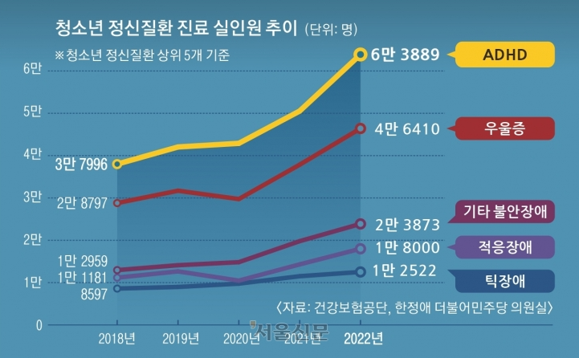
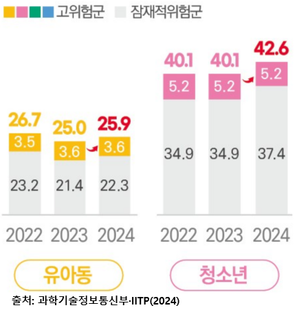

# PPT

- 표지, 목차 포함 최대 16 슬라이드

## 1 슬라이드

(로고)경일대학교x유라클

경북 네트워크형 캠퍼스 SW아카데미 풀스택 개발자 양성과정 7기

프로젝트 주제명 : 중·고등학생 학습 챌린지 소셜 플랫폼

- 학교명: 경일대학교
- 팀명: Study Mate
- 팀장: 박정현
- 팀원: 김지훈, 한진환, 아딜렛

---

## 2 슬라이드 : 목차

### 1. 프로젝트 개요

1. 프로젝트 추진 배경
2. 활용 목적 및 타겟 오디언스
3. 프로젝트 개발 환경

### 2. 추진체계 및 일정

1. 팀 조직도 및 역할분담
2. 개발 일정
   - 요구 분석, 설계, 개발, 통합 테스트 등 프로젝트 진행 일정 기술

### 3. 시스템 개발 내용

1. 전체 시스템 구성도(사이트 맵)
2. 사용자 인터페이스(UI)
3. 서비스별 설명(ex: (1) 메인페이지, (2) 회원 서비스, (3) 기타 등등 자율)

### 4. 시연 영상 및 기대효과

1. 시연 영상
   - 3분 내외
2. 프로젝트 기대효과
3. 향후 계획 및 보완사항

---

## 3 슬라이드 : 프로젝트 개요-추진배경

### 작성 사항

- 본 프로젝트를 수행하게 된 추진 배경, 어떠한 문제를 해결하기 위한 배경 등에 대해 설명

### 예상 슬라이드 내용

소제목: 왜 학생들은 혼자 공부하기 어려울까?

- 자기주도 학습의 난관
  - 신종호 교수: 목적의식 부재, 흥미 결여, 혼공 난이도로 인해 목표 대비 실행률 저하
- 디지털 환경의 역설
  - 청소년 스마트폰 과의존 위험군 비율 42.6%로 주의 분산 환경 확대
- 주의력 지원 필요성 증가
  - ADHD 진료 학생 수가 2018년 3만 8천명 → 2022년 6만 4천명으로 약 2배 증가
- 기존 학습 도구의 한계
  - SNS는 학습 목표/진도 관리 부재, 습관 앱은 동료 기반 상호작용 부족 → 꾸준함 유지 실패

(도표) ADHD 증가 추이 + 스마트폰 과의존 비율 그래프

---

## 4 슬라이드 : 프로젝트 개요-활용 목적 및 타겟 오디언스

### 작성 사항

- 본 프로젝트의 활용 목적과 어떤 대상층이 타겟 오디언스가 되는지 기술
- 이를 통해 대상층에게 어떤 효과를 제공할 수 있는지 간략히 설명

### 예상 슬라이드 내용

소제목: 혼자 하는 공부를 친구와 함께하는 챌린지로

- 타켓 대상: 중·고등학생을 위한 학습 플랫폼
- 제공 효과
  1. 동기 부여: 친구들과 서로 응원·가벼운 경쟁으로 참여 지속
  2. 성취 시각화: 주간/전체/30일 달성률 그래프와 GitHub 잔디형 캘린더로 진척도 즉시 확인
  3. 맞춤 추천: 학습 인증 내용을 AI가 태깅하여 관심 분야 챌린지를 우선 노출

---

## 5 슬라이드 : 프로젝트 개요-프로젝트 개발 환경

### 작성 사항

- 본 프로젝트를 수행할 시, 사용된 '개발도구, 프론트·백엔드 언어, 라이브러리, 운영체제, 웹서버, DBMS'등 에대해서 도표·구성사진 등을 이용해 간략히 설명

### 예상 슬라이드 내용

- Frontend : React, Vite, Morpheus
- Server : Node.js(Express), JWT
- DB : PostgreSQL(Supabase)
- 관리 Tool : GitHub
- Dev Tool : VS Code, Android Studio, Postman

---

## 6 슬라이드 : 추진체계 및 일정-팀 조직 및 역할분담

### 작성 사항

- 팀장, 팀원별 프로젝트 기획 ~ 개발 전체에 걸친 세부 팀 조직도(그림, 도표 등) 기임
- 개발 역할 분담 작성

### 예상 슬라이드 내용

- 박정현 : UI·UX 설계, Server와 DB 설계 및 구현, Gemini 연동, PPT 제작
- 김지훈 : UI·UX 설계, Frontend 구현, UI·UX 구현
- 한진환 : UI·UX 설계, Frontend 구현
- 아딜렛 : 자료조사

---

## 7 슬라이드 : 추진체계 및 일정-개발 일정

### 작성 사항

- Gantt 차트 형태의 개발 일정 삽입

### 예상 슬라이드 내용

- 1주차: 10/13~10/17 주제 선정
- 2주차: 10/20~10/24 UI·UX 설계 / 서버와 DB 설계
- 3주차: 10/27~10/31 프론트엔드 구현 및 UI·UX 구현 / Supabase 연결 및 API와DB 구현
  - 로그인/회원가입/JWT 구현
- 4주차: 11/03~11/07 프론트엔드 구현 및 UI·UX 구현 / API 구현
  - 핵심 기능 구현
- 5주차: 11/10~11/14 프론트엔드 구현 및 UI·UX 구현 / API 구현
  - 핵심 기능 구현
- 6주차: 11/17~11/21 최종 UI·UX 구현 / 최종 테스트 및 발표 준비

---

## 8 슬라이드 : 시스템 개발 내용-전체 시스템 구성도(사이트 맵)

### 작성 사항

- 본 프로젝트를 한 눈에 이해할 수 있는 전체 시스템 구성도 삽입 및 설명
- 꼭 사용자·관리자로 나누어 설명할 필요 없음

### 예상 슬라이드 내용

---

## 9 슬라이드 : 시스템 개발 내용-사용자 인터페이스(UI)

### 작성 사항

- 사용자 인터페이스(UI) 사진 첨부 필수
- UI 구성과 관련된 간편한 설명

### 예상 슬라이드 내용

- 화면 구성(캡쳐)
  1. (Home)챌린지 목록 화면
  2. 인증글 작성 화면
  3. 주간 달성률 화면
  4. 전체·최근 30일 누적 달성률 그래프 & GitHub 잔디형 캘린더
  5. 달성률 랭킹 화면

---

## 10 슬라이드 : 시스템 개발 내용-서비스별 설명-Home

### 작성 사항

- 사용자 페이지 상세 기능별 설명(주요 기능 3~4가지에 대하여 설명)

### 예상 슬라이드 내용

1. 챌린지 목록 화면(+ 참여·좋아요 토글)
2. 챌린지 등록
3. 참여자·좋아요·인증글 지표(+ 참여자·좋아요 목록)

- 챌린지를 등록하고 목록 탐색
- 좋아요·참여 토글로 즉시 신청·취소, 참여·인증 횟수 실시간 갱신
- 좋아요·참여자 목록 확인으로 참여 동기 강화

---

## 11 슬라이드 : 시스템 개발 내용-서비스별 설명-학습 인증

1. 챌린지 상세 정보 탭 (기간·빈도·좋아요·참여 지표)
2. 인증글 등록 화면
3. 인증글 등록 + 응원 토글
4. 인증글 응원자 목록

- JSON 기반 인증글에 목표·요약·학습 시간·학습 자료 작성
- 서버 검증으로 챌린지별 하루 1회 업로드 제한·미참여 차단
- Gemini API를 이용해 업로드 직전 욕설·비방 등 유해 표현이 포함된 인증글 필터링
- 인증글 목록에서 최신 인증글과 응원 토글·응원자 목록·응원 여부를 함께 확인
- 인증 업로드 직후 전체·주간 인증 실적과 진행률이 즉시 갱신

---

## 12 슬라이드 : 시스템 개발 내용-서비스별 설명-달성률

1. 참여·등록 챌린지 목록 내 주간 달성률 막대 그래프
2. 달성률을 탭 했을 때 열리는 전체·최근 30일 달성률 그래프 페이지
3. 동일 페이지에 함께 노출되는 GitHub 잔디형 캘린더
4. 최근 30일 달성률 기준 팔로우 관계 기반 랭킹

- 인증 횟수와 목표 빈도를 기반으로 그래프와 캘린더를 자동 계산
- 인증 업로드 직후 달성률 지표 즉시 갱신
- 기간별 그래프와 캘린더를 비교해 누적 학습 성과와 학습 패턴 변화를 파악
- 팔로워·팔로잉 간 랭킹을 통해 경쟁 동기를 강화하여 챌린지 참여 의지를 유지

---

## 13 슬라이드 : 시스템 개발 내용-서비스별 설명-AI 추천 챌린지

1. 인증글 등록 화면
2. tag_jobs & user_tags 테이블 화면
3. 추천 챌린지 목록 화면

- 인증글을 업로드하면 먼저 `tag_jobs` 큐에 작업이 쌓이고, Gemini가 순서대로 내용을 읽어 과목·개념 태그를 최대 5개 추출
- 추출된 태그는 처리 즉시 `user_tags` 테이블에 가중치처럼 누적되어 '이 사용자가 자주 다루는 주제'를 기록
- 추천 탭에서는 누적된 태그와 챌린지의 태그를 비교해 개인 점수를 매기고, 점수가 높은 챌린지를 상단에 배치

---

## 14 슬라이드 : 시연 영상 및 기대 효과-시연 영상

### 작성 사항

- 시연 영상 1식도 함께 별첨 파일로 개별 제출
- 3분 내외

### 예상 슬라이드 내용

- 3분 이내 시연 영상

  - 챌린지 등록 → 챌린지 목록 → 챌린지 참여 토글 클릭 → 좋아요 토글 클릭 → 특정 챌린지 클릭 → 해당 챌린지 인증글 등록 → 인증글 목록 → 응원 토글 → 사용자 페이지(참여·등록 챌린지 목록) → 달성률 그래프

---

## 15 슬라이드 : 시연 영상 및 기대효과-프로젝트 기대효과

### 작성 사항

- 프로젝트 수행을 통해 기대되는 예상 기대효과

### 예상 슬라이드 내용

- 학습 루틴 고착화: 하루 한 번 인증 구조로 목표→학습→인증 과정을 고정
- 사회적 동기 부여: 좋아요·응원·팔로우·랭킹으로 친구와의 가벼운 경쟁·응원이 지속 참여를 촉진
- 자기 인식 향상: 그래프와 캘린더가 누적 성과와 빈틈을 시각화 → 스스로 학습 전략 조정

---

## 16 슬라이드 : 시연 영상 및 기대효과-향후 계획 및 보완사항

### 작성 사항

- 프로젝트 향후 계획 및 보완사항

### 예상 슬라이드 내용

1. 푸시 알림·학습 타이머 연동
   - 미인증 참여자 대상 '재촉하기' 알림 도입으로 챌린지 동기 유지
   - 학습 타이머 연동을 통해 인증 기록의 정확성 향상
2. AI 인증 검증 고도화
   - 욕설 차단을 넘어 챌린지 적합성·허위 여부·학습 피드백까지 자동 검증하는 절차 마련
3. 학교/지역 단위 확장
   - 학교별 전용 챌린지와 지역·학교별 랭킹 시스템 도입으로 경쟁과 참여 유도
4. 학습 리포트 생성
   - 누적 인증 데이터를 기반으로 주간/월간 리포트를 자동 발급하고, 학습 방향 설계 자료로 활용
